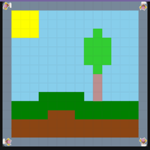

# Unit 1 - Asphalt Art

## Introduction

Cities use asphalt art to improve public safety, inspire their residents and visitors, and brighten communities. Your goal is to create asphalt art to revitalize The Neighborhood and bring the community together with the help of the Painter.

## Requirements

Use your knowledge of object-oriented programming, algorithms, the problem solving process, and decomposition strategies to create asphalt art:
- **Create a new subclass** – Create at least one new subclass of the PainterPlus class that is used for a component of the asphalt art design.
- **Plan an algorithm** – Use the problem solving process and decomposition strategies to plan an algorithm that incorporates a combination of sequencing, selection, and/or iteration.
- **Write a method** – Write at least one method in a PainterPlus subclass that contributes to a component of the asphalt art design.
- **Document your code** – Use comments to explain the purpose of the methods and code segments.

## Notes: Neighborhood & Painter Class

This project was created on Code.org's JavaLab platform using the built-in Neighborhood GUI output. To test and edit this project you must build in Code.org's JavaLab with the Neighborhood GUI enabled. For reference to the Painter class documentation, [you can read more here.](https://studio.code.org/docs/ide/javalab/classes/Painter)

## Output:

## Reflection

### 1. Describe your project.
It is a simple picture of a landscape with a tree, ground, and sun.

### 2. What are two things about your project that you are proud of?

I am proud of the tree, since it looks nice, and how I made the ground.

### 3. Describe something you would improve or do differently if you had an opportunity to change something about your project.

I would make some of the methods more generally usable, such as the framepainters makeFrame not only working on a 16x16 area.

### 4. How is this project related to STEAM (Science, Technology, Engineering, Art, and Mathematics)? Provide explicit examples from the project and details as possible. 

The code itself is in Java, connecting to the technologu portion, and the image shown above is the output art, which is the Art portion of steam

### 5. What SLOs did you demonstrate during completing this project?

The SLO's I demonstrated were:

1. **Critical Thinking**: I displayed critical thinking in the creation of the various algorithms to make them create their own component of the image.

2. **Self-Directed Goal-Oriented Individuals**: I worked toward the goal of using the 16x16 frame.